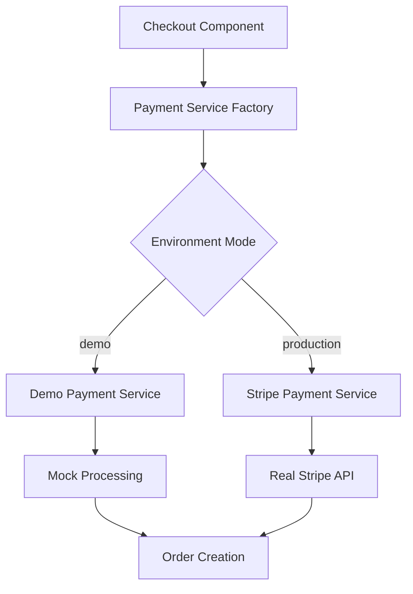
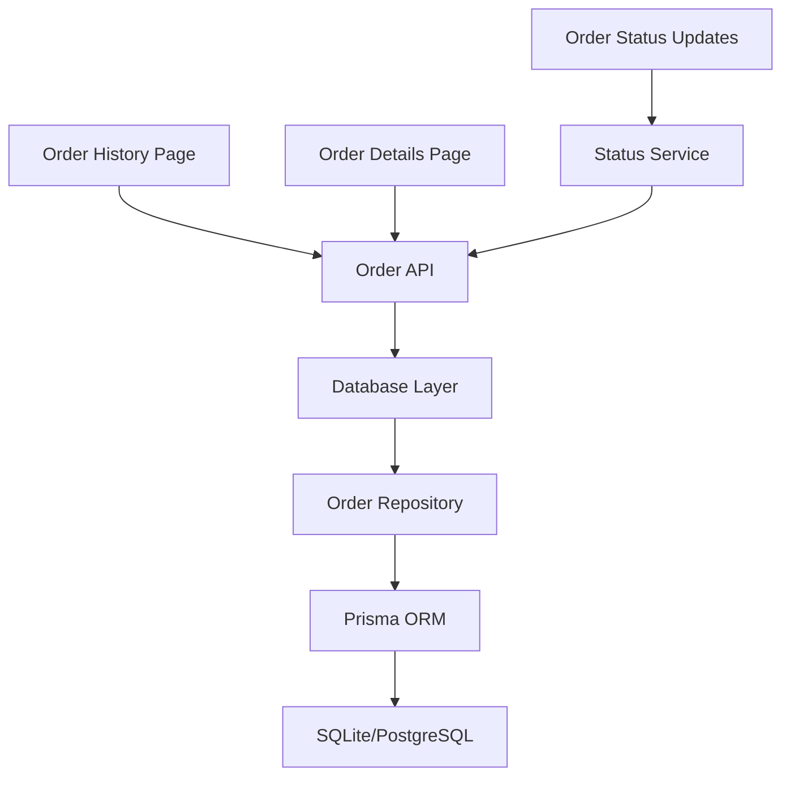
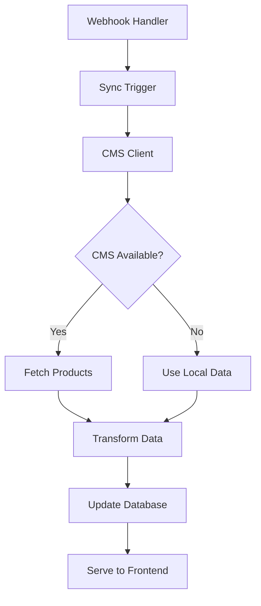

# Demo Store Completion - Design Document

## Overview

This design document outlines the architecture and implementation approach for completing the Kin Workspace demo store. The system uses a service abstraction pattern to enable seamless switching between demo and production modes.

## Architecture

### Payment Service Architecture



The payment system uses an abstract factory pattern to provide different implementations based on environment configuration. This allows the same checkout flow to work in both demo and production modes.

### Order Management Architecture



The order management system leverages the existing Prisma database schema and builds user-facing interfaces for order tracking and management.

### CMS Integration Architecture



## Components and Interfaces

### Payment Service Interface

```typescript
interface PaymentService {
  processPayment(amount: number, method: PaymentMethod): Promise<PaymentResult>
  createPaymentIntent(amount: number): Promise<PaymentIntent>
  confirmPayment(intentId: string): Promise<PaymentResult>
  getPaymentMethods(): Promise<PaymentMethod[]>
  isDemo(): boolean
}

interface PaymentResult {
  success: boolean
  paymentId: string
  error?: string
  receipt?: PaymentReceipt
}

interface DemoPaymentConfig {
  successRate: number
  processingDelay: number
  enableFailureSimulation: boolean
  demoCardNumbers: string[]
}
```

### Order Management Interface

```typescript
interface OrderService {
  getUserOrders(userId: string, filters?: OrderFilters): Promise<Order[]>
  getOrderById(orderId: string): Promise<Order | null>
  updateOrderStatus(orderId: string, status: OrderStatus): Promise<void>
  cancelOrder(orderId: string): Promise<boolean>
  createReorder(orderId: string): Promise<CartItem[]>
}

interface OrderFilters {
  status?: OrderStatus[]
  dateRange?: [Date, Date]
  searchTerm?: string
  sortBy?: 'date' | 'amount' | 'status'
}
```

### CMS Integration Interface

```typescript
interface CMSService {
  getProducts(filters?: ProductFilters): Promise<CMSProduct[]>
  getProduct(slug: string): Promise<CMSProduct | null>
  getCategories(): Promise<Category[]>
  syncProducts(): Promise<SyncResult>
  isConnected(): Promise<boolean>
}

interface SyncResult {
  success: boolean
  productsUpdated: number
  errors: string[]
  lastSync: Date
}
```

## Data Models

### Enhanced Order Model

The existing Prisma schema already includes comprehensive order models. The design extends these with additional fields for demo functionality:

```typescript
interface DemoOrder extends Order {
  isDemoOrder: boolean
  demoPaymentMethod: string
  demoStatusProgression?: DemoStatusConfig
}

interface DemoStatusConfig {
  autoAdvance: boolean
  progressionDelay: number
  nextStatus: OrderStatus
}
```

### Payment Models

```typescript
interface DemoPayment {
  id: string
  orderId: string
  amount: number
  method: 'demo-visa' | 'demo-mastercard' | 'demo-amex'
  status: 'pending' | 'completed' | 'failed'
  processingTime: number
  createdAt: Date
}
```

## Error Handling

### Payment Error Handling

1. **Demo Payment Failures**: Configurable failure rate with realistic error messages
2. **Network Errors**: Graceful degradation with retry mechanisms
3. **Validation Errors**: Client-side validation with server-side verification
4. **Service Unavailable**: Fallback to cached data or maintenance mode

### CMS Error Handling

1. **Connection Failures**: Automatic fallback to local product data
2. **Sync Errors**: Partial sync recovery with error reporting
3. **Data Validation**: Schema validation for incoming CMS data
4. **Rate Limiting**: Respect CMS API limits with exponential backoff

### Order Management Error Handling

1. **Database Errors**: Transaction rollback with user notification
2. **Status Update Failures**: Retry mechanism with manual override
3. **Concurrent Updates**: Optimistic locking to prevent conflicts
4. **Data Integrity**: Validation checks before order modifications

## Testing Strategy

### Demo Payment Testing

1. **Unit Tests**: Test payment service implementations
2. **Integration Tests**: Test complete checkout flow
3. **Error Simulation**: Test failure scenarios and recovery
4. **Performance Tests**: Verify processing delays are realistic

### Order Management Testing

1. **CRUD Operations**: Test all order management functions
2. **Status Transitions**: Verify order status workflows
3. **User Permissions**: Ensure users can only access their orders
4. **Data Consistency**: Verify order data integrity

### CMS Integration Testing

1. **Connection Tests**: Test CMS connectivity and authentication
2. **Sync Tests**: Verify product data synchronization
3. **Fallback Tests**: Test local data fallback scenarios
4. **Performance Tests**: Ensure sync operations don't block UI

## Security Considerations

### Demo Mode Security

1. **Clear Indicators**: Prevent confusion about real vs demo transactions
2. **Data Isolation**: Separate demo data from production data
3. **Access Controls**: Limit demo mode to development environments
4. **Audit Logging**: Track demo transactions for debugging

### Production Security

1. **Payment Security**: PCI compliance for real payment processing
2. **Data Encryption**: Encrypt sensitive customer data
3. **API Security**: Secure CMS and payment API communications
4. **User Authentication**: Maintain secure user sessions

## Performance Optimization

### Demo Mode Performance

1. **Local Processing**: All demo operations run locally
2. **Minimal Dependencies**: Reduce external service calls
3. **Caching**: Cache demo data for faster responses
4. **Lazy Loading**: Load demo data on demand

### Production Performance

1. **Payment Processing**: Optimize Stripe integration
2. **Database Queries**: Efficient order retrieval with pagination
3. **CMS Caching**: Cache CMS data with appropriate TTL
4. **Image Optimization**: Optimize product images from CMS

## Deployment Strategy

### Demo Deployment

1. **Local Development**: Complete offline functionality
2. **Demo Environment**: Staging environment with demo mode
3. **Documentation**: Clear setup instructions for demo mode
4. **Reset Functionality**: Easy demo data reset

### Production Migration

1. **Environment Variables**: Simple configuration switch
2. **Service Integration**: Connect real payment and email services
3. **Data Migration**: Migrate demo orders to production format
4. **Monitoring**: Set up production monitoring and alerts